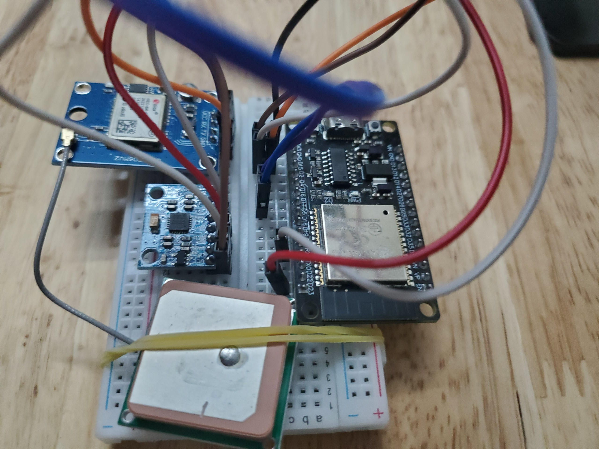

# Embedded System Project

This project is a major assignment for the Embedded Systems course at our academy. It simulates a sensor system for a car using ESP32, incorporating two main sensors:

- **Neo 6m GPS**: Tracks longitude, latitude, altitude, speed, and real-time data.
- **MPU6050**: Measures three-axis acceleration and gyroscopic data, with an integrated temperature sensor.

Data from these sensors is stored in a Realtime Database.

A binary classification model is developed to detect "normal" vs. "abnormal" driving behavior based on acceleration and gyroscopic data.

The model is built using Python and the PyCaret library. More detail at [./nhung-model-training](nhung-model-training)

The model is deployed on Cloud Function, triggered by updates in the Realtime Database. More detail at [./rtdb-trigger-func](rtdb-trigger-func)

## Development board interface

### Connection specifications
| ESP32 | MPU-6050 |
|:-----:|:--------:|
|  D22  |    SCL   |
|  D21  |    SDA   |
|  3V3  |    VCC   |
|  GND  |    GND   |

| ESP32 | NEO 6m GPS |
|:-----:|:----------:|
|  RX2  |     TX     |
|  TX2  |     RX     |
|  3V3  |     VCC    |
|  GND  |     GND    |

# [Demo video](/readme-sauce/demo-video.mp4)
<video src="https://github.com/sonsonson110/esp32-location-motion-tracking/raw/main/readme-sauce/demo-video.mp4" width="100%"></video>

## Development Environment

- **Operating System**: Ubuntu 22.04.4 LTS
- **Python Version**: Python 3.10.12
- **Arduino IDE**: 2.3.2
- **Node.js**: v20.13.1